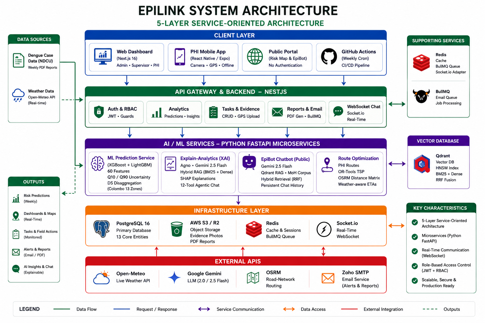
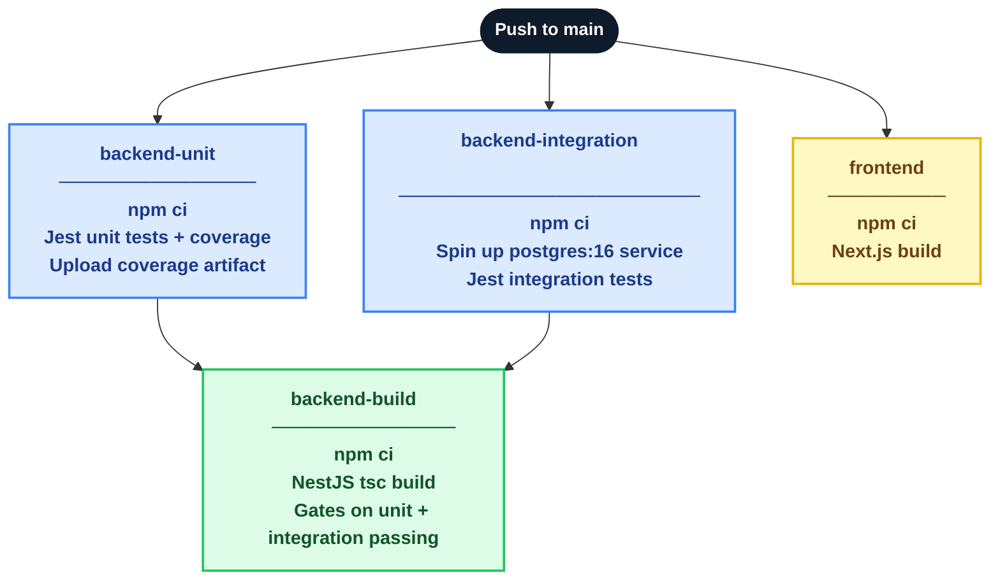
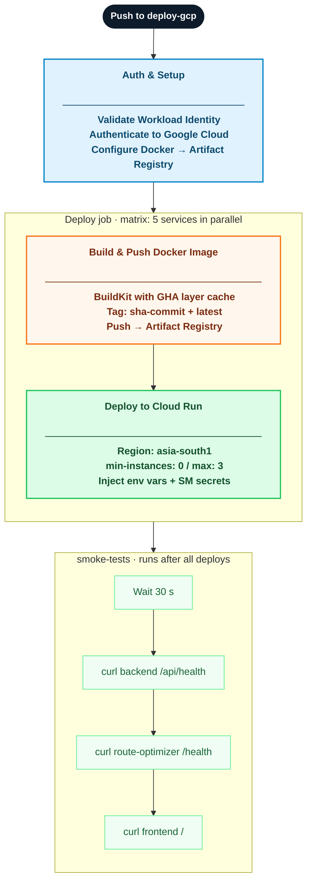
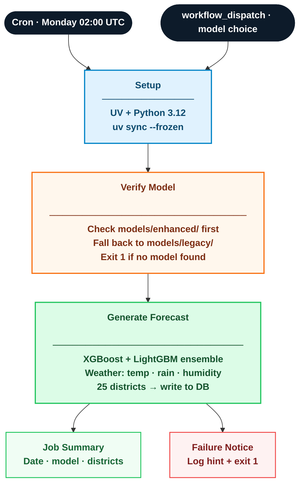

# EpiLink — System Architecture & Implementation

> **Project:** EpiLink Dengue Risk Monitoring & Cleanup Management System
> **Author:** Charuka Karunarathna — Final Year Project, NSBM Green University (University of Plymouth affiliation)
> **Platform Version:** 4.0 (Phases 1–5 complete)
> **Model Version:** 2.0.0

---

## Table of Contents

1. [System Overview](#1-system-overview)
2. [Architecture Diagram](#2-architecture-diagram)
3. [Technology Stack](#3-technology-stack)
4. [Service Topology & Interactions](#4-service-topology--interactions)
5. [NestJS Backend API](#5-nestjs-backend-api)
6. [ML Prediction Service](#6-ml-prediction-service)
7. [Explain-Analytics (XAI) Microservice](#7-explain-analytics-xai-microservice)
8. [Public Chatbot — EpiBot](#8-public-chatbot--epibot)
9. [Route Optimization Microservice](#9-route-optimization-microservice)
10. [Web Dashboard (Next.js)](#10-web-dashboard-nextjs)
11. [PHI Mobile Application](#11-phi-mobile-application)
12. [Public Risk Dashboard](#12-public-risk-dashboard)
13. [Real-Time Communication](#13-real-time-communication)
14. [Data Layer](#14-data-layer)
15. [Email & Notification System](#15-email--notification-system)
16. [Object Storage](#16-object-storage)
17. [AI Chat History System](#17-ai-chat-history-system)
18. [CI/CD Pipelines](#18-cicd-pipelines)
19. [Non-Functional Requirements](#19-non-functional-requirements)
20. [Test Coverage](#20-test-coverage)

---

## 1. System Overview

EpiLink is a full-stack, role-based dengue risk monitoring and field coordination platform built for the Sri Lankan Ministry of Health. It ingests epidemiological and weather data weekly, produces ML-driven risk predictions per district, and coordinates Public Health Inspector (PHI) field operations through task assignment, evidence tracking, and real-time communication.

### User Roles

| Role | Key Capabilities |
|------|-----------------|
| **Admin** | National analytics, task analytics dashboard, user management, weekly reports, alert configuration, XAI insights, AI chat history |
| **Supervisor** | District dashboard, task creation and assignment, evidence review queue, PHI workload view, task-centric chat |
| **PHI** | Mobile task management, evidence upload (camera + GPS), route optimization, task-centric chat |
| **Public** | Risk forecast map, district lookup, health guidance, EpiBot chatbot |

### Core Objectives

| Objective | Status |
|-----------|--------|
| Automate weekly dengue case ingestion and weather correlation | Complete |
| Predict next-week dengue risk per district with uncertainty bounds | Complete |
| Interactive dashboards for national, district, and field-level decisions | Complete |
| Task assignment, evidence collection, and field reporting for PHIs | Complete |
| AI-powered explainable insights grounded in MoH documents | Complete |
| Public AI chatbot for dengue inquiries | Complete |
| PHI mobile app with route optimization and evidence upload | Complete |
| Real-time alerts and weekly report delivery | Complete |
| DS-level spatial disaggregation for Colombo | Complete |

---

## 2. Architecture Diagram



The diagram above illustrates the full service topology: clients at the top layer communicate through the NestJS backend, which coordinates with PostgreSQL, Redis, and S3 for persistence, and delegates to four Python microservices (ML Prediction, Explain-Analytics, Public Chatbot and Route Optimization) for specialised computation.

---

## 3. Technology Stack

| Layer | Technology | Version / Notes |
|-------|-----------|-----------------|
| **Frontend (Web)** | Next.js, React, TypeScript, Tailwind CSS | Next.js 16, React 19 |
| **UI Components** | Shadcn UI, Radix Primitives | Sheet, Dialog, Toast, Table |
| **Charts** | Recharts | BarChart, LineChart, PieChart, RadialBarChart |
| **Maps** | Leaflet / React-Leaflet | District heatmap, task location, route visualization |
| **Mobile** | React Native / Expo | SDK 51+ |
| **Mobile Capabilities** | expo-image-picker, expo-location, expo-file-system | Camera, GPS, multipart upload |
| **Backend API** | NestJS, TypeORM | Node.js 24 |
| **Database** | PostgreSQL | v16 |
| **Caching / Queue** | Redis + BullMQ | Email queue, session cache, Socket.io adapter |
| **Real-time** | Socket.io | Tasks, chat, analytics feed |
| **Object Storage** | AWS S3 / Cloudflare R2 | `@aws-sdk/client-s3` |
| **Email** | Nodemailer + Zoho SMTP | Handlebars HTML templates |
| **ML Service** | Python, FastAPI, XGBoost, LightGBM, Optuna | v2.0 ensemble |
| **Explain-Analytics** | Python, FastAPI, Agno, APScheduler | Gemini 2.0 Flash |
| **Vector Database** | Qdrant | HNSW index, BM25 + dense hybrid |
| **Embeddings** | Google text-embedding-004 | 768-dim |
| **Chatbot LLM** | Gemini 2.5 Flash | Public EpiBot |
| **Insights LLM** | Gemini 2.0 Flash | Admin XAI service |
| **CI/CD** | GitHub Actions, Husky | Weekly cron, pre-commit hooks |
| **Deployment** | Docker, Cloud Run (GCP) | asia-south1 region |

---

## 4. Service Topology & Interactions

```
┌─────────────────────────────────────────────────────────────────────────────┐
│                              CLIENTS                                         │
├─────────────────┬─────────────────────────┬─────────────────────────────────┤
│   Web Dashboard │    PHI Mobile App       │    GitHub Actions (Cron)         │
│   (Next.js 16)  │  (React Native / Expo)  │    Weekly prediction + ETL       │
└────────┬────────┴───────────┬─────────────┴──────────────┬──────────────────┘
         │                    │                            │
         ▼                    ▼                            ▼
┌─────────────────────────────────────────────────────────────────────────────┐
│                       NestJS Backend API (Port 3001)                         │
├─────────────────────────────────────────────────────────────────────────────┤
│  Auth  │  Users  │  Analytics  │  Tasks  │  Evidence  │  Reports  │  Email  │
│  Chat  │ Storage │ Notifications│Districts│TaskAnalytics│  WebSocket         │
└────────┬─────────┴──────┬──────┴─────────────────────────────────────────-─┘
         │                │
         ▼                ▼
┌─────────────────┐   ┌────────────────────┐   ┌──────────────────────────┐
│   PostgreSQL 16  │   │   Object Storage   │   │         Redis             │
│  15 core tables  │   │    AWS S3 / R2     │   │  BullMQ email queue       │
│  Prediction data │   │  Evidence photos   │   │  Socket.io adapter        │
│  Chat messages   │   │  PDF reports       │   │  XAI session cache        │
└────────┬─────────┘   └────────────────────┘   └──────────────────────────┘
         │
    ┌────┴─────────────────────────────────────────┐
    ▼                                               ▼
┌──────────────────────────┐      ┌────────────────────────────────────────┐
│  ML Prediction Service   │      │  Explain-Analytics (XAI) Microservice  │
│  (Python FastAPI)         │      │  (Python FastAPI + Agno + Gemini)      │
│  XGBoost + LightGBM      │      │  PostgreSQL → APScheduler ETL →        │
│  60-feature ensemble      │      │  text-embedding-004 → Qdrant           │
│  Quantile regression CI   │      │  BM25+dense hybrid → Gemini 2.0 Flash  │
└──────────────────────────┘      └────────────────────────────────────────┘

┌────────────────────────────────────────┐   ┌──────────────────────────────┐
│  Public Chatbot — EpiBot               │   │  Route Optimization Service   │
│  Gemini 2.5 Flash + Qdrant             │   │  OR-Tools TSP + OSRM matrix   │
│  Hybrid BM25 + dense RAG               │   │  Returns ordered waypoints    │
└────────────────────────────────────────┘   └──────────────────────────────┘
```

### Inter-Service Communication

| Source | Target | Protocol | Description |
|--------|--------|----------|-------------|
| GitHub Actions (Cron) | ML Prediction Service | Direct DB write | Weekly forecast job writes predictions to PostgreSQL via TypeORM |
| NestJS | ML Prediction Service | HTTP REST | `POST /predict/bulk` for on-demand bulk prediction |
| NestJS | Explain-Analytics | HTTP REST (JWT forwarded) | Forwards user JWT; XAI service validates token against NestJS auth — no shared service keys |
| NestJS | Route Optimization | HTTP REST (internal) | Sends task coordinates, receives optimized waypoint order + ETAs |
| Explain-Analytics | Qdrant | Docker network TCP | Reads and writes vector embeddings on port 6333 |
| Explain-Analytics | PostgreSQL | Direct connection | APScheduler ETL reads `dengue_cases` and `predictions` weekly |
| NestJS | Redis | TCP | BullMQ job queue (email), Socket.io pub/sub adapter, XAI session cache |
| NestJS | PostgreSQL | TypeORM | All persistent entity reads and writes |
| NestJS | S3 / R2 | HTTPS (AWS SDK) | Evidence photo uploads, PDF report storage, signed URL generation |
| Web / Mobile clients | NestJS | HTTPS REST + WebSocket | All API calls and real-time events |

---

## 5. NestJS Backend API

**Directory:** `backend/` | **Port:** 3001

The backend is the central coordination hub. All clients communicate exclusively through it — no client talks directly to a microservice.

### Module Inventory

| Module | Key Responsibility |
|--------|--------------------|
| `auth` | JWT (httpOnly cookies), Passport.js, RBAC guards |
| `users` | CRUD, role assignment, district allocation, notification preferences |
| `analytics` | District predictions, trends, hotspots, DS-level breakdown, XAI proxy |
| `tasks` | Full lifecycle CRUD, status transitions, evidence, chat, task analytics |
| `evidence` | Evidence entity, approve/reject with mandatory reason |
| `reports` | Weekly PDF generation, S3 storage, Gemini-generated narrative |
| `email` | BullMQ + Nodemailer + Zoho SMTP, Handlebars templates, audit log |
| `storage` | `StorageService` wrapping `@aws-sdk/client-s3` (S3 + R2) |
| `notifications` | In-app notifications, push notification stubs (Firebase Admin) |
| `districts` | District boundaries, metadata |
| `cache` | `CacheHelperService` — SWR Redis caching with cache-manager fallback |
| `gateway` | Socket.io `/events` namespace — tasks, chat, analytics real-time feed |

### Task Lifecycle

```
PENDING → ASSIGNED → IN_PROGRESS → SUBMITTED → VERIFIED → COMPLETED
                                       │
                                  REJECTED (mandatory rejectionReason)
                                       │
                                  Back to IN_PROGRESS (resubmit)
```

Minimum evidence before a PHI can submit:

| Task Type | Minimum Photos |
|-----------|:--------------:|
| Cleanup | 2 |
| Fogging | 1 |
| Inspection | 1 |
| Investigation | 2 |

### Evidence Upload Flow

```
PHI selects photo (web/mobile)
    │
    ▼
POST /api/upload/evidence  (multipart/form-data, max 10 MB, JPEG/PNG/WebP)
    │
    ▼
StorageService → S3/R2 → returns permanent URL
    │
    ▼
POST /api/tasks/:id/evidence  (imageUrl, notes, latitude, longitude)
    │
    ▼
Supervisor reviews in Evidence Review Queue
    │
    ├─> Approve → evidence.status = APPROVED
    └─> Reject  → evidence.status = REJECTED, rejectionReason required
```

### API Reference Summary

#### Authentication
```
POST   /api/auth/login              User login → JWT httpOnly cookie
GET    /api/auth/me                 Current user
POST   /api/auth/logout             Clear session
```

#### Analytics
```
GET    /api/analytics/districts/latest              Latest data per district
GET    /api/analytics/predict/bulk                  ML predictions all districts
GET    /api/analytics/summary                       Dashboard summary
GET    /api/analytics/trends                        Case trend over time
GET    /api/analytics/advanced/hotspots             Top hotspot districts
GET    /api/analytics/advanced/outbreak-alerts      Active outbreak alerts
GET    /api/analytics/explain/:district             SHAP-grounded district insight
POST   /api/analytics/explain/:district/chat        Agentic chat (12 tools)
GET    /api/analytics/national-summary              National executive situation report
GET    /api/analytics/colombo/ds-breakdown          Colombo DS-level estimates
GET    /api/analytics/chat/sessions                 Admin chat session list
GET    /api/analytics/chat/:sessionId/history       Full message history
GET    /api/analytics/chat/:sessionId/export        Download transcript (JSON/Markdown)
PATCH  /api/analytics/chat/:sessionId/title         Rename session
PATCH  /api/analytics/chat/:sessionId/archive       Soft-archive session
DELETE /api/analytics/chat/:sessionId               Delete session
```

#### Tasks
```
GET    /api/tasks                              List (role-scoped)
POST   /api/tasks                              Create
GET    /api/tasks/:id                          Detail with relations
PATCH  /api/tasks/:id                          Update fields
PATCH  /api/tasks/:id/status                   Status transition
POST   /api/tasks/:id/evidence                 Submit evidence
GET    /api/tasks/evidence/pending             Pending evidence queue (supervisor)
GET    /api/tasks/:id/messages                 Chat history
POST   /api/tasks/:id/messages                 Send chat message
GET    /api/tasks/analytics/national-summary   National task KPIs
GET    /api/tasks/analytics/by-district        Per-district stats
GET    /api/tasks/analytics/by-status          Status distribution
GET    /api/tasks/analytics/trend              Creation vs completion trend
GET    /api/tasks/analytics/phis               PHI performance metrics
GET    /api/tasks/analytics/overdue            Overdue tasks with severity
```

#### Users
```
GET    /api/users                 List all (admin)
POST   /api/users                 Create
PATCH  /api/users/:id             Update
DELETE /api/users/:id             Delete
GET    /api/users/phis/workload   Per-PHI workload aggregates
```

#### Upload & Reports
```
POST   /api/upload/evidence        Multipart image → S3/R2 URL
GET    /api/reports                List weekly reports
POST   /api/reports/generate       Generate for year/week
GET    /api/reports/:id            Detail + PDF signed URL
```

---

## 6. ML Prediction Service

**Directory:** `ml-model/` | **Framework:** FastAPI (Python)

### Ensemble Architecture

The service uses a **v2.0 production-grade ensemble pipeline** combining XGBoost and LightGBM with Optuna hyperparameter tuning, 60 engineered features, quantile regression uncertainty bounds, and 4-level risk classification.

```
┌──────────────┐    ┌──────────────────┐    ┌───────────────────────────┐
│  Raw Data    │───>│ Feature Engineer │───>│       Ensemble Model       │
│ (PostgreSQL) │    │   (60 features)  │    │  XGBoost (60%) +           │
└──────────────┘    └──────────────────┘    │  LightGBM (40%)            │
                                            └─────────────┬─────────────┘
                                                          │
                                            ┌─────────────▼─────────────┐
                                            │  Uncertainty (Q10/Q90)    │
                                            │  Quantile regression CI   │
                                            └─────────────┬─────────────┘
                                                          │
                                            ┌─────────────▼─────────────┐
                                            │  Prediction + 80% CI +    │
                                            │  Risk Level + SHAP Values │
                                            └───────────────────────────┘
```

### Feature Engineering (60 Features)

| Group | Count | Examples |
|-------|:-----:|---------|
| Lag features | 10 | `cases_lag1–4`, `temp_lag1`, `precip_lag1–2`, `humidity_lag1` |
| Rolling statistics | 6 | `cases_mean_4w`, `cases_std_4w`, `cases_max_8w` |
| Cyclical / seasonal | 6 | `week_sin/cos`, `month_sin/cos`, `is_southwest_monsoon`, `is_northeast_monsoon` |
| Trend & momentum | 5 | `cases_wow_pct_change`, `cases_trend_3w`, `is_accelerating`, `outbreak_momentum` |
| Weather interaction | 3 | `temp_humidity_interaction`, `is_optimal_breeding`, `hot_wet_index` |
| Population | 3 | `population_density`, `log_population_density`, `population_density_norm` |
| District one-hot | 25 | `district_Colombo`, `district_Gampaha`, ... (all 25 districts) |

### Model Performance

| Metric | v1.0 Baseline | v2.0 Ensemble | Improvement |
|--------|:-------------:|:-------------:|:-----------:|
| Test MAE | 2.95 cases | 2.22 cases | 25% reduction |
| Test R² | 0.982 | 0.991 | Near-perfect fit |
| Training R² | 0.929 | 0.946 | Better generalization |
| Feature count | ~10 | 60 | 6x more signals |
| Confidence intervals | None | 80% CI (Q10/Q90) | New capability |
| Risk classification | None | 4 levels | New capability |
| Actual CI coverage | — | 79% | Target: 80% |

### Risk Classification

| Level | Threshold | Recommended Action |
|-------|:---------:|--------------------|
| Low | < 10 cases | Routine surveillance |
| Medium | 10–30 cases | Enhanced monitoring |
| High | 30–50 cases | Activate outbreak response |
| Critical | > 50 cases | Emergency intervention |

### Prediction Response (v2.0)

```json
{
  "district": "Colombo",
  "predicted_cases": 42,
  "confidence_interval": { "lower": 35, "upper": 49, "confidence_level": 0.8 },
  "risk_level": "high",
  "model_version": "2.0.0",
  "shap_values": {
    "cases_mean_4w": 0.38,
    "outbreak_momentum": 0.29,
    "precipitation_sum": 0.12
  }
}
```

### Colombo DS-Level Disaggregation

District-level Colombo predictions are disaggregated into 13 Divisional Secretariat (DS) division estimates using a composite spatial weight computed at serve-time in NestJS:

```
DS_cases_i = district_total × weight_i

weight_i = 0.50 × population_proportion_i
         + 0.30 × density_score_i
         + 0.20 × historical_burden_score_i
```

### Service Endpoints

| Method | Path | Description |
|--------|------|-------------|
| `POST` | `/predict` | Single district prediction with CI and risk level |
| `POST` | `/predict/bulk` | All 26 districts |
| `POST` | `/predict/bulk/districts` | Multiple districts with per-district features |
| `GET` | `/model/info` | Model metadata and performance metrics |
| `GET` | `/districts` | Supported district list |
| `GET` | `/risk/thresholds` | Current risk classification thresholds |

### Source Structure

```
ml-model/
├── app.py
├── src/
│   ├── enhanced/
│   │   ├── feature_engineering.py   # 60-feature pipeline
│   │   ├── model_tuning.py          # Optuna + TimeSeriesSplit CV
│   │   ├── ensemble_model.py        # XGBoost + LightGBM ensemble
│   │   ├── uncertainty_estimation.py# Quantile regression + risk levels
│   │   └── train.py                 # Unified training entry point
│   ├── forecasting/
│   │   ├── weekly.py                # Weekly cron prediction job
│   │   ├── ds_disaggregation.py     # Colombo DS-level disaggregation
│   │   └── features.py              # Feature pipeline for inference
│   └── api/                         # FastAPI route handlers
└── models/
    ├── dengue_ensemble_model.pkl
    ├── uncertainty_estimator.pkl
    ├── feature_engineer.pkl
    └── model_metadata.pkl
```

---

## 7. Explain-Analytics (XAI) Microservice

**Directory:** `explain-analytics/` | **Framework:** FastAPI + Agno (Python)

A production-grade RAG microservice that translates ML predictions and SHAP values into plain-language, actionable insights grounded in Ministry of Health documents.

### RAG Pipeline

```
[PostgreSQL] ──┐
               ├──> APScheduler ETL (weekly)
[Weather API] ─┘          │
                           ▼
              Text + insight generation
                           │
              text-embedding-004 (768-dim dense vectors)
              BM25 fastembed (sparse vectors)
                           │
                    Qdrant Vector DB
              (HNSW index ef_construction=200, m=16)
                           │
              Hybrid Retriever: α·dense + β·sparse
              RRF Fusion + Recency Decay Scoring
                           │
              Gemini 2.0 Flash — grounded response
                           │
              Admin Dashboard / Agentic Chat
```

### Interaction with NestJS

- NestJS forwards the user's JWT to the XAI service — no shared service API keys
- The XAI service validates the token against NestJS auth before serving any response
- After each chat response, NestJS upserts the session row and persists messages to PostgreSQL (fire-and-forget, non-blocking)

### Agentic Chat Tools (12 Tools)

| Tool | Purpose |
|------|---------|
| `get_district_prediction` | Current week prediction + CI for a district |
| `get_district_trend` | Case trend over configurable week window |
| `get_weather_correlation` | Temperature/precipitation correlation for district |
| `get_outbreak_alerts` | Active outbreak alert list |
| `get_hotspot_analysis` | Top hotspot districts |
| `get_national_summary` | Aggregate national metrics |
| `get_national_briefing` | Full executive situation report |
| `get_seasonal_pattern` | Historical seasonal pattern for district |
| `get_cross_district_spillover` | Spillover risk across district neighbours |
| `get_intervention_history` | Past intervention actions and outcomes |
| `get_model_performance_metrics` | Current model MAE, R², feature importance |
| `get_demographic_hotspots` | Population-density-adjusted risk hotspots |

### Key Capabilities

| Capability | Implementation |
|------------|---------------|
| SHAP-grounded drivers | Insights cite actual model feature importances — not heuristic rules |
| Hybrid retrieval | BM25 + dense vectors with RRF fusion; time-decay boosts recent MoH guidelines |
| National briefing | Single-call executive report for all 26 districts; `URGENT:` prefix when risk score >= 0.85 |
| Geographic spillover | Flags `spillover_risk` when 3+ neighbouring districts rise simultaneously |
| Redis session persistence | 2-hour TTL, auto-compress at 10 turns |
| PostgreSQL message fallback | Full message log restored when Redis TTL expires |

---

## 8. Public Chatbot — EpiBot

**Directory:** `chatbot/` | **Access:** No authentication required

A public-facing dengue Q&A service using hybrid RAG over a curated knowledge base of 6 Ministry of Health PDFs.

| Component | Detail |
|-----------|--------|
| Vector DB | Qdrant — HNSW index, payload filtering |
| Retrieval | Dense (text-embedding-004) + sparse (BM25 fastembed) with RRF fusion |
| Knowledge base | 6 PDFs: Epidemiology Unit reports, WHO guidelines, prevention tips |
| LLM | Gemini 2.5 Flash |
| Session | `session_id` for conversation continuity |

---

## 9. Route Optimization Microservice

**Service name:** `route-optimizer` | **Framework:** Python | **Port:** 8001

Computes optimal visit order for a PHI's daily task list using the Travelling Salesman Problem (TSP) solver backed by real-road travel times from OSRM.

### Technology

| Component | Technology | Role |
|-----------|-----------|------|
| **TSP Solver** | Google OR-Tools | Finds the minimum-cost visitation order across all task locations |
| **Distance Matrix** | OSRM (Open Source Routing Machine) | Produces real-road travel time/distance between every pair of task coordinates — avoids straight-line distortion |
| **API** | Python (FastAPI / Flask) | Receives task coordinate payloads from NestJS; returns ordered waypoints |

### Request Flow

```
PHI taps "Optimize Route" on RouteOptimizationScreen
    │
    ▼
routeService.optimizeRoute(taskIds, phiLocation)        NestJS internal REST call
    │
    ▼
Route service fetches task coordinates from request payload
    │
    ▼
OSRM real-road distance matrix computed for all location pairs
    │
    ▼
OR-Tools TSP solver finds minimum-cost visitation order
    │
    ▼
Returns: ordered waypoints + per-leg ETAs + total distance + total time
    │
    ▼
NestJS forwards result to mobile client
    │
    ▼
RouteOptimizationScreen renders optimized route on map with per-stop ETAs
```

### NestJS Integration

- NestJS makes an **internal REST call** to the route optimizer, passing task coordinates and the PHI's current GPS location
- The service is not exposed externally — all access is proxied through the NestJS backend
- No authentication token forwarding is required (internal service boundary)

### Mobile Integration

The `RouteOptimizationScreen` in the PHI mobile app:
- Displays the optimized waypoint sequence with numbered stops
- Shows per-leg ETAs and total estimated travel time
- Renders the route visually on an embedded map
- Auto-recalculates when a task is **completed** or an **urgent task is added** to the PHI's active list

### Deployment

| Property | Value |
|----------|-------|
| Service name | `route-optimizer` |
| Port | 8001 |
| Cloud Run memory | 512 Mi |
| Region | asia-south1 |
| Smoke test | `curl route-optimizer /health` (runs after every deploy) |

---

## 10. Web Dashboard (Next.js)

**Directory:** `frontend/` | **Framework:** Next.js 16, React 19, Tailwind CSS

### Admin Pages

| Route | Purpose |
|-------|---------|
| `/admin/analytics` | Analytics dashboard with navigation rail |
| `/admin/tasks/analytics` | Task Analytics Dashboard (national overview) |
| `/admin/tasks/analytics/district/[id]` | District drill-down |
| `/admin/tasks/analytics/phi/[id]` | PHI performance profile |
| `/admin/users` | User management |
| `/admin/reports` | Weekly report list and generation |

### Analytics Dashboard Layout

The dashboard uses a single-level navigation rail with 7 panels replacing a previous two-level nested tab system:

**Nav Rail Panels:** Risk Map · Trends · Alerts · Hotspots · AI Insights · Historical · National

| Before | After |
|--------|-------|
| 2 clicks minimum (outer + inner tab) | 1 click to any panel |
| Floating chat bubble overlapping charts | Slide-in drawer (380 px, right edge) |
| District context lost on tab switch | Persistent district context strip |

### Supervisor Pages

| Route | Purpose |
|-------|---------|
| `/supervisor/tasks` | Task list with filter, search, list/map toggle |
| `/supervisor/tasks/[id]` | Task detail: evidence review, verify, reject |
| `/supervisor/evidence` | Evidence Review Queue — batch approve/reject |
| `/supervisor/phis` | PHI list + workload dashboard |

### Task Analytics Dashboard (5 Phases)

| Phase | Content |
|-------|---------|
| Backend | 10 analytics endpoints, all guarded by Admin role |
| National overview | KPI cards, district bar chart, status donut, trend dual-line chart |
| District drill-down | Breadcrumb nav, supervisor table, PHI leaderboard |
| PHI profile | KPI cards, task status donut, monthly trend, evidence approval gauge |
| Real-time monitoring | `LiveActivityFeed` (Socket.io), `OverdueTasksAlert` (severity: warning/critical) |

---

## 11. PHI Mobile Application

**Directory:** `mobile/` | **Framework:** React Native / Expo SDK 51+

### Screen Inventory

| Screen | Key Features |
|--------|-------------|
| `LoginScreen` | JWT auth, remember-me |
| `TaskListScreen` | Real-time task list, status/type filter, unread badges |
| `TaskDetailScreen` | Animated timeline, evidence list, start/submit/restart, minimum-evidence guard |
| `EvidenceUploadScreen` | Camera + gallery picker, GPS auto-tag, notes, multipart upload to S3/R2 |
| `TaskMapScreen` | Task location on map, directions |
| `RouteOptimizationScreen` | Optimized waypoint order from OR-Tools TSP, OSRM ETAs |
| `NotificationsScreen` | Bell feed, unread count badge |

### Performance Optimizations

- `React.memo` on all list and map subcomponents — eliminates re-render lag on large task lists
- Screen-scale utility replaces hardcoded pixel values for consistent sizing across device sizes
- `ToastContext` wraps the entire app — four variants (success, error, warning, info) with auto-dismiss and swipe-to-dismiss

---

## 12. Public Risk Dashboard

**Directory:** `frontend/app/risk-map/`

Five enhancement phases delivering a non-technical, accessible public experience:

| Phase | Focus |
|-------|-------|
| 1 — Plain Language | Everyday Sri Lankan English labels; `PublicSummaryBanner` generates natural-language paragraphs from live API data |
| 2 — Visual Simplification | `TrendStoryChart`, `DistrictWatchList`, `DistrictRiskTable` (searchable, traffic-light icons) |
| 3 — Guided Onboarding | `OnboardingBanner` (3-step, sessionStorage), redesigned tab labels, `InfoTooltip` on technical terms |
| 4 — Actionable Guidance | `ActionGuidance` per risk level, `NationalStatusBar` (5 levels), official MoH resource links |
| 5 — Mobile & Accessibility | Tap-to-select, responsive single-scroll layout <768 px, WCAG AA contrast, `aria-label` on map elements |

---

## 13. Real-Time Communication

**Technology:** Socket.io on NestJS `/events` namespace

Redis pub/sub adapter enables horizontal scaling across multiple NestJS instances.

### Room Design

| Room | Members | Purpose |
|------|---------|---------|
| `role:admin` | All admins | User management, system-wide events |
| `role:supervisor` | All supervisors | Task assignments, district events |
| `district:{id}` | Users in that district | District-scoped task and analytics events |
| `user:{id}` | Single user | Personal notifications |
| `task:{id}` | Task participants | Task-centric chat messages |

### Event Catalogue

| Event | Trigger | Consumer |
|-------|---------|---------|
| `task:created` | New task | Supervisor dashboard |
| `task:updated` | Any field change | Task detail page |
| `task:status-changed` | Status transition | PHI app + supervisor |
| `task:assigned` | PHI assigned | Assigned PHI |
| `task:deleted` | Task removed | All task participants |
| `chat:message` | New chat message | Task chat panel |
| `chat:read` | Message read receipt | Unread badge |
| `chat:reaction` | Reaction toggled | Task chat panel |
| `chat:broadcast` | District broadcast | All PHIs in district |
| `user:created` | New user created | Admin/supervisor |
| `user:updated` | User fields changed | Admin/supervisor |
| `user:status-changed` | Account activated/deactivated | Admin/supervisor |
| `analytics:updated` | New ML predictions | Analytics dashboard |
| `task-analytics:update` | Task status change | Admin live feed |

---

## 14. Data Layer

### PostgreSQL Schema

| Table | Key Fields |
|-------|-----------|
| `users` | id, email, role (ADMIN/SUPERVISOR/PHI/VIEWER), districtId, isActive |
| `districts` | id, name, boundaries (GeoJSON), population, area |
| `dengue_cases` | id, districtId, week, year, caseCount |
| `weather_data` | id, districtId, date, temperature, precipitation, humidity |
| `predictions` | id, districtId, week, year, predictedCases, riskLevel, confidenceInterval, shapValues |
| `tasks` | id, type, status, priority, districtId, assignedPhiId, createdBy, dueDate, rejectionReason |
| `evidence` | id, taskId, imageUrl, notes, latitude, longitude, status, submittedBy, rejectionReason |
| `task_messages` | id, taskId, senderId, content, attachmentUrl, createdAt |
| `message_reads` | id, messageId, userId, readAt |
| `notifications` | id, userId, type, title, body, isRead, createdAt |
| `weekly_reports` | id, week, year, districtId, pdfUrl, narrativeSummary, generatedAt |
| `email_logs` | id, to, subject, type, status (SENT/FAILED), attempts, createdAt |
| `audit_logs` | id, userId, action, entity, entityId, metadata, createdAt |
| `analytic_chat_sessions` | id, sessionId, userId, district, title, turnCount, isArchived |
| `analytic_chat_messages` | id, chatSessionId, role (user/model), content, toolCalls (JSONB) |

### Redis Usage

| Purpose | TTL | Details |
|---------|-----|---------|
| Socket.io pub/sub adapter | Persistent | Multi-instance real-time event bus |
| BullMQ email job queue | Until processed | Fire-and-forget; failures never propagate to callers |
| XAI chat session messages | 2 hours | Auto-compress at 10 turns; PostgreSQL fallback on expiry |
| Task/PHI list cache | Configurable | SWR pattern: serve stale, refresh in background |
| Unread message count cache | Invalidated on read | Per-task per-user counter |

---

## 15. Email & Notification System

**Directory:** `backend/src/email/`

All email sending is fire-and-forget through BullMQ — failures never block the calling service.

### Infrastructure

- **Transport:** Nodemailer + Zoho SMTP
- **Queue:** BullMQ + Redis with exponential backoff retries
- **Templates:** Handlebars HTML templates per notification type
- **Audit:** `email_logs` entity records every sent/failed email
- **Opt-out:** Per-user preference per notification category

### Notification Matrix

| Category | Triggers |
|----------|---------|
| **User** | Account creation, password reset, welcome |
| **Task lifecycle** | New assignment (to PHI), status change, overdue reminder, completion (to supervisor) |
| **Evidence** | Submission alert, approval/rejection with reason |
| **Reports** | Weekly report delivery |
| **Alerts** | High-risk district alert, national outbreak notification, weekly digest |

---

## 16. Object Storage

**Provider:** AWS S3 or Cloudflare R2 (same SDK, different endpoint)

| Content Type | Max Size | Validation |
|-------------|:--------:|------------|
| Evidence photos | 10 MB | JPEG, PNG, WebP — validated server-side before upload |
| Weekly report PDFs | — | `application/pdf`, content-disposition: attachment |

Signed URLs are generated at read time with a short TTL — no public access to the bucket.

---

## 17. AI Chat History System

ChatGPT-style conversation history for admin users, backed by PostgreSQL with Redis as a fast read cache.

### Message Flow

```
Admin sends message
    │
    ▼
POST /analytics/explain/:district/chat
    │
    ├──> Python XAI service (Gemini 2.0 Flash + Redis message store)
    │           └──> Returns: reply, session_id, turn_count
    │
    ├──> Upsert row in analytic_chat_sessions (Postgres)
    │    Title auto-generated via Gemini on turn 1 (max 6 words, fire-and-forget)
    │
    └──> Persist user + assistant messages in analytic_chat_messages (Postgres, async)

GET /analytics/chat/:sessionId/history
    │
    ├──> Try Redis (fast path, 2-hour TTL)
    └──> If expired: query analytic_chat_messages → re-hydrate Redis → return
```

### Frontend Components

| Component | Role |
|-----------|------|
| `AIChatContainer.tsx` | Outer shell: state, session CRUD, send logic |
| `ChatSidebar.tsx` | Grouped history (Today / Yesterday / This Week / Older), search, New Chat |
| `ChatSessionItem.tsx` | Single row: title, relative time, hover actions (rename / export / delete) |
| `ChatWindow.tsx` | Message thread, loading states, expired-session banner |
| `ChatInput.tsx` | Input bar, send button, `Cmd/Ctrl+K` shortcut |
| `FloatingChatBubble.tsx` | FAB trigger; renders panel in floating or drawer mode |

### UX Features

| Feature | Detail |
|---------|--------|
| Auto-title | First user message triggers Gemini naming the conversation (max 6 words) |
| Export | JSON or Markdown download — browser blob, no extra dependencies |
| Keyboard shortcut | `Cmd/Ctrl+K` opens or focuses the chat panel |
| Expired session banner | "This conversation has expired. Start a new chat below." |
| District sync | Resuming a session auto-sets the page's district selector to the session's district |
| Unread badge | Red badge on FAB counts replies received while panel was closed |

---

## 18. CI/CD Pipelines

### CI Pipeline — `.github/workflows/ci.yml`

Triggered on every push to `main`. Runs all tests, enforces coverage thresholds, and verifies the TypeScript build.



| Job | What it does |
|-----|-------------|
| `backend-unit` | Runs `test:cov --ci --forceExit`; uploads coverage artifact; enforces coverage thresholds |
| `backend-integration` | Spins up `postgres:16` service container; runs `test:integration --forceExit` |
| `backend-build` | Gated on both jobs passing; confirms TypeScript build is clean |
| `frontend` | Runs independently — type-check and Next.js build |

**Required GitHub Actions secret:**

| Secret | Purpose |
|--------|---------|
| `JWT_SECRET` | Test-only value — no production secrets needed; all external services are mocked in CI |

### Deploy Pipeline — `.github/workflows/deploy.yml`

Triggered on push to `deploy-gcp`. Builds Docker images, pushes to GCP Artifact Registry, deploys all services to Cloud Run in parallel, then runs smoke tests.



**Services deployed in parallel:**

| Service | Port | Memory |
|---------|:----:|:------:|
| route-optimizer | 8001 | 512 Mi |
| explain-analytics | 8010 | 1 Gi |
| chatbot-service | 8000 | 1 Gi |
| backend | 3001 | 512 Mi |
| frontend | 3000 | 512 Mi |

### Weekly Forecast Pipeline — `.github/workflows/weekly-forecast.yml`

Triggered automatically every Monday at 02:00 UTC, or manually via `workflow_dispatch`.



---

## 19. Non-Functional Requirements

| Requirement | Target | Notes |
|-------------|--------|-------|
| Dashboard load time | <= 3 seconds | National overview page |
| Concurrent users | 500+ | Socket.io + Redis pub/sub adapter |
| ML service availability | >= 99% uptime | Weekly cron critical path |
| Mobile offline support | 7-day data retention | SQLite local cache |
| Evidence upload | Max 10 MB per image | JPEG/PNG/WebP validated server-side |
| API response time | <= 500 ms (p95) | Excludes ML inference |
| Data retention | 5 years historical | PostgreSQL with index tuning |
| ML model CI coverage | 79–80% | Achieved: 79% |
| XAI retrieval latency | < 2 seconds | Qdrant HNSW + GPU embedding |

---

## 20. Test Coverage

The backend has a comprehensive test suite of **277 tests** (244 unit + 33 integration) running automatically on every push to `main` via GitHub Actions.

### Coverage Thresholds (Enforced by Jest)

| Metric | Threshold |
|--------|:---------:|
| Statements | >= 35% |
| Branches | >= 24% |
| Functions | >= 28% |
| Lines | >= 35% |

### Test Summary by Module

| Module | Unit | Integration | Total |
|--------|:----:|:-----------:|:-----:|
| App / Health | 10 | — | 10 |
| Auth (Service + Controller + Guards) | 20 | 6 | 26 |
| Users (Service + Controller) | 36 | 9 | 45 |
| Tasks (Service + Controller + Messages + Guards) | 54 | 9 | 63 |
| Analytics | 15 | 4 | 19 |
| Reports | 16 | 5 | 21 |
| Email | 10 | — | 10 |
| Storage | 5 | — | 5 |
| Cache Helper | 9 | — | 9 |
| Chatbot | 3 | — | 3 |
| Push Notifications | 6 | — | 6 |
| Events Gateway | 35 | — | 35 |
| **Total** | **219** | **33** | **252** |

For the full module-by-module test case reference — including expected outcomes and CI pass status for every test — see **[TEST_CASES.md](TEST_CASES.md)**.

---

*Last updated: May 2026*
*Model version: 2.0.0*
*Platform version: 4.0 (Phases 1–5 complete)*
