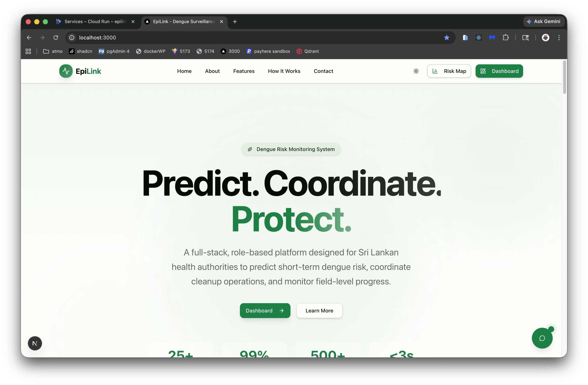
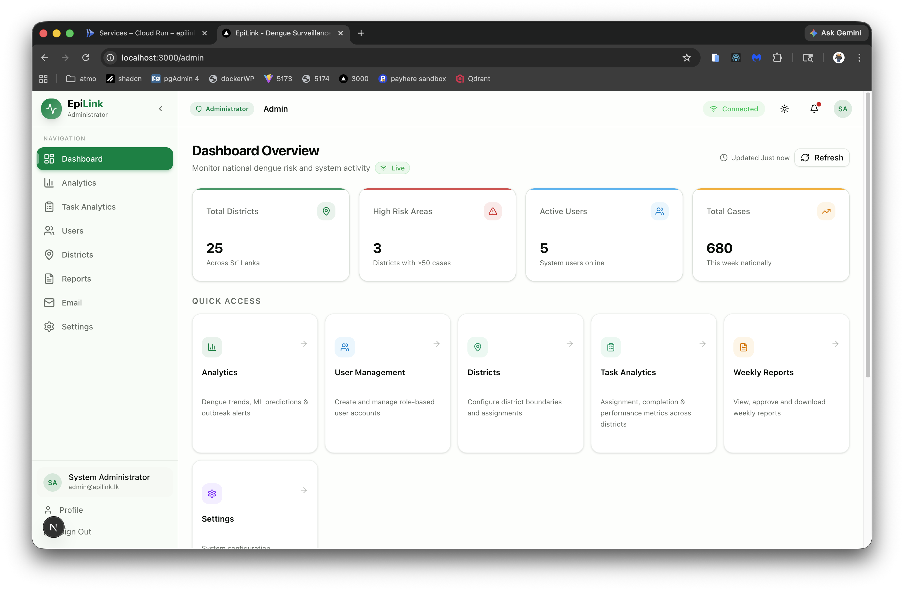
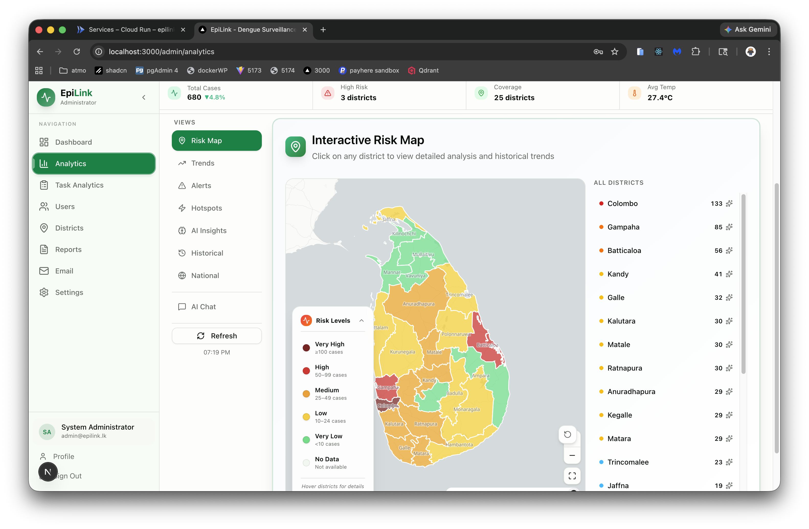
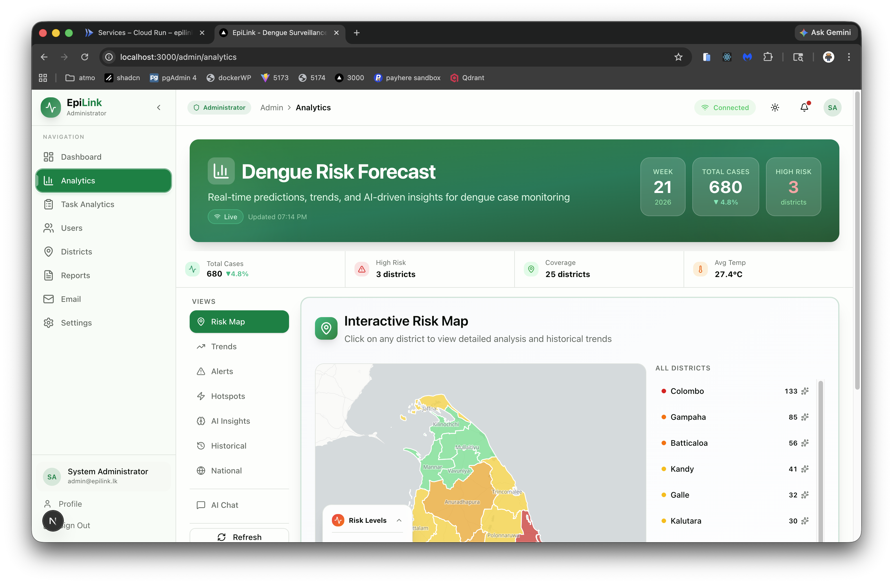
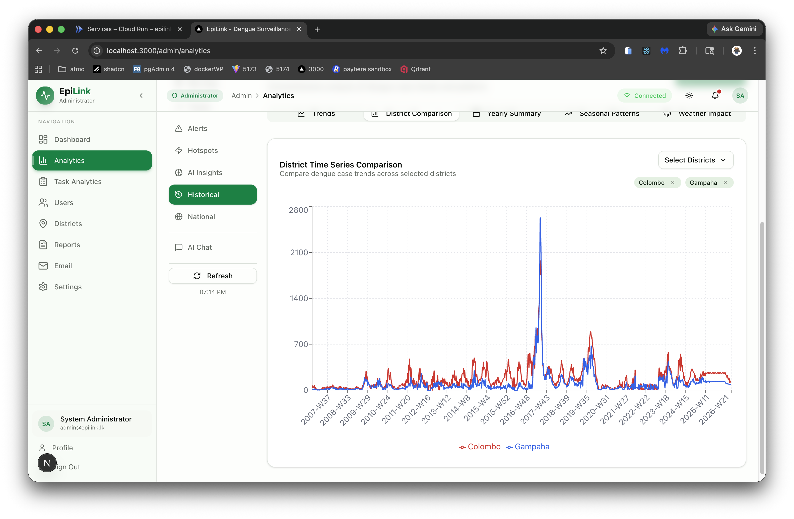
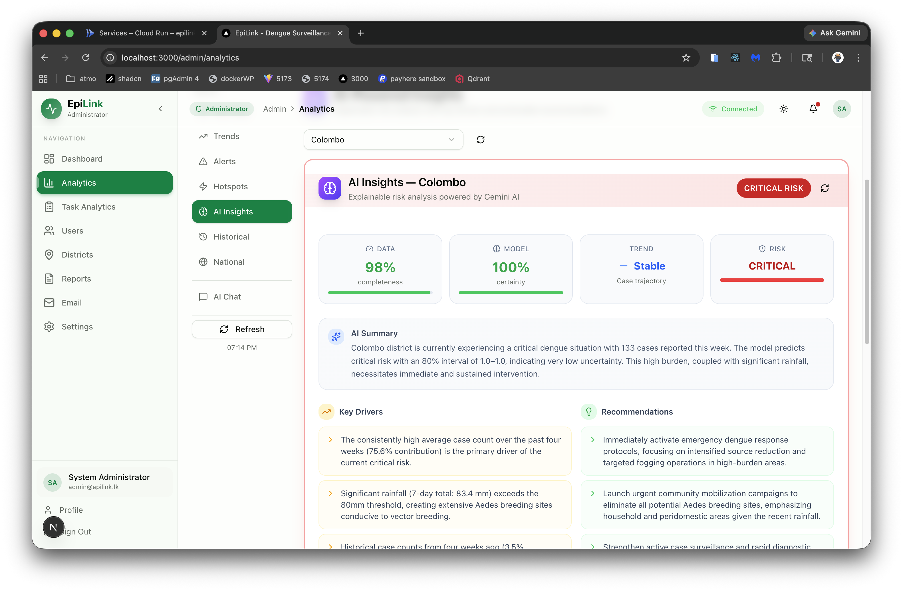
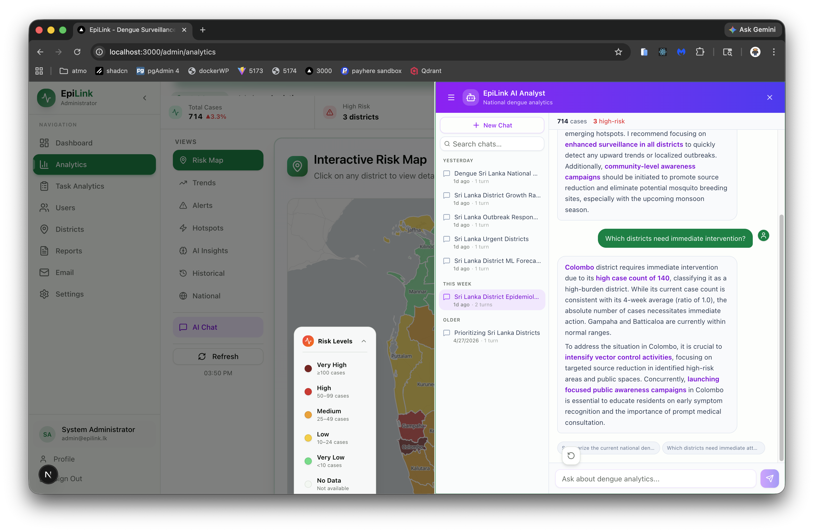
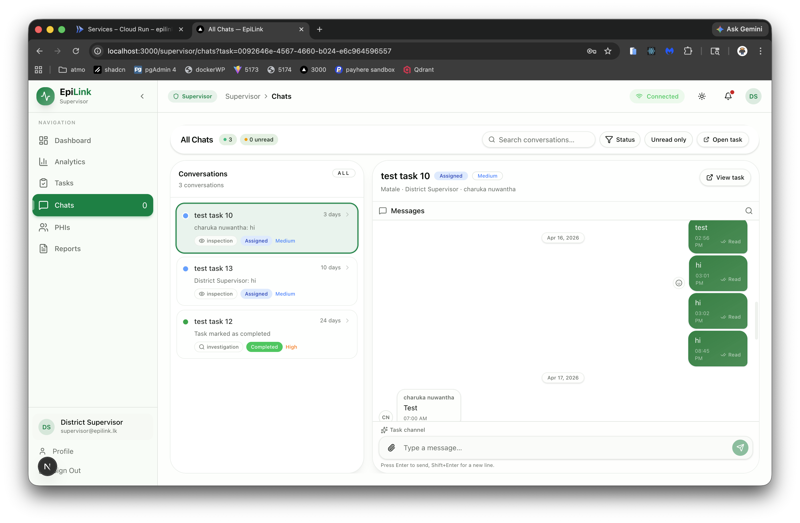
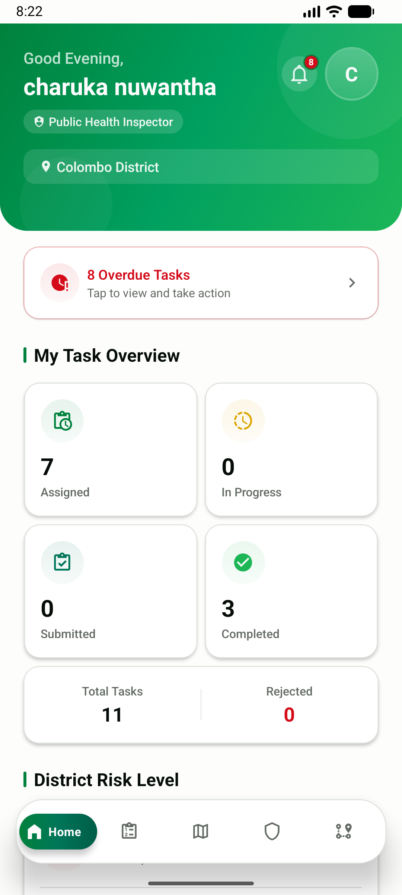
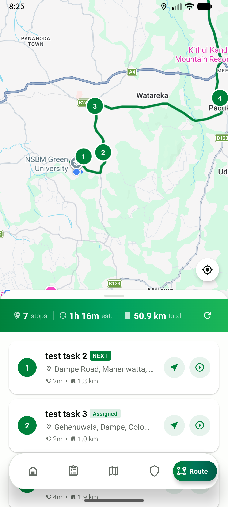

# EpiLink — Dengue Risk Monitoring & Cleanup Management System

> Final Year Project · Charuka Karunarathna · NSBM Green University (University of Plymouth affiliation)
> Platform v4.0 · ML Model v2.0.0

---

## Documentation

| Document | Description |
|---|---|
| [ARCHITECTURE.md](ARCHITECTURE.md) | Full system architecture, service topology, API reference, data layer, CI/CD pipelines, and test coverage |
| [USER_GUIDE.md](USER_GUIDE.md) | Local setup, environment configuration, Docker stack, and development commands |

---

## Overview

EpiLink is a full-stack, role-based dengue risk monitoring and field coordination platform built for the Sri Lankan Ministry of Health. It ingests epidemiological and weather data weekly, produces ML-driven risk predictions per district, and coordinates Public Health Inspector (PHI) field operations through task assignment, evidence tracking, and real-time communication.

**Target users:** Epidemiology Unit, Ministry of Health Sri Lanka, District Health Officers, Public Health Inspectors

---

## Technology Stack

| Layer | Technology |
|---|---|
| **Frontend (Web)** | Next.js 16, React 19, TypeScript, Tailwind CSS, Shadcn UI, Recharts, Leaflet |
| **Frontend (Mobile)** | React Native / Expo SDK 51+ |
| **Backend API** | NestJS, TypeORM, PostgreSQL 16, JWT (httpOnly cookies), Socket.io, BullMQ |
| **ML Service** | Python, FastAPI, XGBoost + LightGBM ensemble, Optuna, SHAP |
| **Explain-Analytics (XAI)** | Python, FastAPI, Agno, Gemini 2.0 Flash, Qdrant, APScheduler |
| **Public Chatbot** | Python, FastAPI, Gemini 2.5 Flash, Qdrant (hybrid BM25 + dense retrieval) |
| **Route Optimizer** | Python, OR-Tools TSP, OSRM real-road distance matrix |
| **Caching / Queue** | Redis — BullMQ email queue, Socket.io pub/sub adapter, XAI session cache |
| **Object Storage** | AWS S3 / Cloudflare R2 |
| **Email** | Nodemailer + Zoho SMTP, Handlebars templates, BullMQ queue |
| **CI/CD** | GitHub Actions (CI, deploy, weekly forecast cron), Husky pre-commit hooks |
| **Deployment** | Docker, Google Cloud Run (asia-south1), GCP Artifact Registry |

---

## Architecture


The platform is composed of a central NestJS backend hub, four Python microservices, and clients across web, mobile, and GitHub Actions. All clients communicate exclusively through the NestJS API — no client connects directly to a microservice.

```
┌─────────────────────────────────────────────────────────────────────────────┐
│                              CLIENTS                                         │
├─────────────────┬─────────────────────────┬─────────────────────────────────┤
│   Web Dashboard │    PHI Mobile App       │    GitHub Actions (Cron)        │
│   (Next.js 16)  │  (React Native / Expo)  │    Weekly prediction + ETL      │
└────────┬────────┴───────────┬─────────────┴──────────────┬──────────────────┘
         │                    │                            │
         ▼                    ▼                            ▼
┌─────────────────────────────────────────────────────────────────────────────┐
│                       NestJS Backend API (Port 3001)                         │
│  Auth · Users · Analytics · Tasks · Evidence · Reports · Email · WebSocket  │
└─────┬───────────────────────────────────────────────────────────────────────┘
      │
      ├──► PostgreSQL 16 (15 tables) · Redis · AWS S3 / R2
      │
      ├──► ML Prediction Service     XGBoost + LightGBM · 60-feature ensemble · 80% CI
      ├──► Explain-Analytics (XAI)   Gemini 2.0 Flash · Qdrant RAG · 12 agentic tools
      ├──► Public Chatbot (EpiBot)   Gemini 2.5 Flash · Qdrant hybrid retrieval
      └──► Route Optimizer           OR-Tools TSP · OSRM real-road ETAs
```

> See [ARCHITECTURE.md](ARCHITECTURE.md) for the full service topology, inter-service communication table, and module inventory.

---

## Screenshots

### Landing Page & Public Risk Dashboard



Public entry point — EpiBot chatbot, district risk lookup, national status bar, and plain-language health guidance, all without authentication.

---

### Admin — Dashboard Overview



National overview with KPI cards, district risk heatmap, outbreak alert feed, and hotspot detection. Every analytical panel is one click away via the left navigation rail.

---

### Admin — Risk Map



Interactive Sri Lanka choropleth map with district-level color-coded predictions and 80% confidence interval bands.

---

### Admin — Prediction Analytics



Trend panel showing case trajectories, confidence interval ribbons, and week-over-week momentum across all 25 districts.

---

### Admin — District Historical Analysis



Year-over-year comparison, seasonal pattern identification, and peak season breakdown scoped per district.

---

### Admin — AI Insights (XAI)



SHAP-grounded district insights generated by the Explain-Analytics microservice — key risk drivers surfaced from ML feature importances and grounded in Ministry of Health documents via hybrid RAG retrieval.

---

### Admin — AI Analyst Chat



Agentic chat with 12 live data tools and a ChatGPT-style history sidebar. Sessions are auto-titled by Gemini, searchable, and persist across page reloads via PostgreSQL + Redis.

---

### Supervisor — Task Chat Hub



Supervisor task-centric chat hub showing all active conversations with assigned PHIs, unread message counts, and per-task context.

---

### PHI Mobile App



React Native / Expo mobile app — real-time task list with status badges, evidence upload with GPS auto-tagging, and minimum-evidence enforcement per task type.

---

### PHI Mobile — Route Optimization



One-tap route optimization powered by OR-Tools TSP + OSRM real-road distance matrix. Displays the optimized stop order with per-leg ETAs and total estimated travel time.

---

## User Roles

| Role | Key Capabilities |
|---|---|
| **Admin** | National analytics, task analytics dashboard, user management, weekly reports, alert configuration, XAI insights, AI chat history |
| **Supervisor** | District dashboard, task creation and assignment, evidence review queue, PHI workload view, task-centric chat |
| **PHI** | Mobile task management, evidence upload (camera + GPS), route optimization, task-centric chat |
| **Public** | Risk forecast map, district lookup, health guidance, EpiBot chatbot |

---

## Key Features

### ML Risk Prediction (v2.0 Ensemble)

XGBoost (60%) + LightGBM (40%) ensemble trained with Optuna hyperparameter tuning and TimeSeriesSplit cross-validation on 60 engineered features — lag counts, rolling statistics, cyclical/seasonal signals, trend & momentum, weather interactions, population density, and district one-hot encodings. Quantile regression provides 80% confidence intervals (Q10/Q90) with 79% achieved coverage.

| Metric | v1.0 Baseline | v2.0 Ensemble |
|---|:---:|:---:|
| Test MAE | 2.95 cases | 2.22 cases |
| Test R² | 0.982 | 0.991 |
| Features | ~10 | 60 |
| Confidence intervals | — | 80% CI |

Risk levels: **Low** (< 10) · **Medium** (10–30) · **High** (30–50) · **Critical** (> 50 cases)

Colombo district is further disaggregated into 13 DS-division estimates using population, density, and historical burden weights.

---

### Explainable AI Analytics (XAI)

A production-grade RAG microservice (`explain-analytics`) that translates ML predictions and SHAP values into plain-language, actionable insights grounded in Ministry of Health documents.

- **Hybrid retrieval:** BM25 + dense vectors (text-embedding-004, 768-dim) in Qdrant with RRF fusion and recency decay scoring
- **Agentic chat:** 12 live data tools covering district predictions, trends, weather correlations, hotspots, spillover risk, intervention history, and model performance
- **ChatGPT-style history:** PostgreSQL-backed session index with Redis fast path; sessions are auto-titled, searchable, exportable as JSON or Markdown, and survive Redis TTL expiry via Postgres fallback
- **National briefing:** Single-call executive situation report across all 26 districts; `URGENT:` prefix when risk score ≥ 0.85
- **Automated ETL:** APScheduler weekly job keeps the Qdrant corpus current with new surveillance data

---

### Task & Evidence Management

Full task lifecycle from creation to field completion with real-time WebSocket updates throughout.

```
PENDING → ASSIGNED → IN_PROGRESS → SUBMITTED → VERIFIED → COMPLETED
                                       │
                                  REJECTED (mandatory reason) → IN_PROGRESS
```

Task types: **Cleanup · Fogging · Inspection · Investigation**

Minimum evidence photos required before submission: Cleanup (2), Fogging (1), Inspection (1), Investigation (2). All evidence is geo-tagged and stored in S3/R2 with signed URL access.

---

### PHI Mobile Application

React Native / Expo mobile app for field officers with:

- Real-time task list with status badges and unread notification counts
- Camera + gallery evidence upload with automatic GPS tagging and multipart S3 upload
- **Route optimization** — OR-Tools TSP solver + OSRM real-road distance matrix delivering an ordered stop sequence with per-leg ETAs; auto-recalculates on task completion or urgent task addition
- Task-centric chat with supervisors
- In-app toast system (success / error / warning / info) with auto-dismiss

---

### Public Risk Dashboard

A non-technical, accessible public experience at `/risk-map`:

- Plain-language risk labels, contextual metric cards, and a `PublicSummaryBanner` generating natural-language paragraphs from live data
- `NationalStatusBar` with five severity levels (Calm → Critical)
- `TrendStoryChart` area chart with calendar week labels and peak callouts
- `DistrictRiskTable` — searchable with traffic-light icons
- `ActionGuidance` per risk level with concrete prevention recommendations and official MoH resource links
- Fully responsive on mobile (< 768 px), WCAG AA contrast, `aria-label` on all interactive map elements

---

### Public Chatbot — EpiBot

Unauthenticated RAG chatbot for dengue inquiries backed by 6 Ministry of Health PDFs.

- Qdrant HNSW vector index with hybrid BM25 + dense retrieval and RRF fusion
- Gemini 2.5 Flash for natural-language responses
- Session continuity via `session_id`

---

### Real-Time Communication

Socket.io on NestJS `/events` namespace with a Redis pub/sub adapter for horizontal scaling. Events cover task lifecycle, task-centric chat, evidence review, user management, analytics updates, and the admin live activity feed.

---

### Email & Notification System

Fire-and-forget BullMQ + Nodemailer + Zoho SMTP pipeline — failures never propagate to callers.

Covers: account creation, task assignment, evidence approval/rejection, overdue reminders, weekly reports, high-risk district alerts, and national outbreak notifications. Per-user opt-out per notification category.

---

### Weekly Reports

Auto-generated PDF reports with a Gemini-written narrative summary, stored in S3/R2 with signed URL access. Triggered manually per year/week or scheduled automatically.

---

### CI/CD Pipelines

| Pipeline | Trigger | What it does |
|---|---|---|
| `ci.yml` | Push to `main` | Backend unit tests (244) + integration tests (33) + TypeScript build + Next.js build |
| `deploy.yml` | Push to `deploy-gcp` | Builds 5 Docker images, deploys to Cloud Run in parallel, runs smoke tests |
| `weekly-forecast.yml` | Monday 02:00 UTC | XGBoost + LightGBM forecast for all 25 districts, writes results to PostgreSQL |

---

## Database Schema

| Table | Description |
|---|---|
| `users` | Roles (ADMIN / SUPERVISOR / PHI / VIEWER), district assignment, account status |
| `districts` | Sri Lankan district boundaries (GeoJSON), population, area |
| `dengue_cases` | Weekly case counts per district |
| `weather_data` | Temperature, precipitation, humidity observations |
| `predictions` | ML predictions — risk level, confidence interval, SHAP values |
| `tasks` | Type, status, priority, assigned PHI, due date, rejection reason |
| `evidence` | Photos, GPS coordinates, notes, approval status |
| `task_messages` | Task-scoped chat messages |
| `message_reads` | Per-user read receipts |
| `notifications` | In-app alerts |
| `weekly_reports` | Generated report records with S3 PDF links |
| `email_logs` | Sent/failed email audit with retry tracking |
| `audit_logs` | User activity tracking |
| `analytic_chat_sessions` | AI chat session index — title, district, turn count, archive flag |
| `analytic_chat_messages` | Full message log per session — role, content, tool calls (JSONB) |

---

## Development Setup

See [USER_GUIDE.md](USER_GUIDE.md) for the full local setup walkthrough including environment configuration, Docker stack commands, OSRM data preparation, and mobile app setup.

### Quick Start

```bash
# Clone
git clone https://github.com/cnkarunarathna/epilink-system.git
cd epilink-system

# Copy and configure environment files
cp backend/.env.example backend/.env
cp frontend/.env.example frontend/.env
# (also copy .env.example for chatbot-service, explain-analytics, ml-model, route-optimizer)

# Prepare OSRM routing data (one-time, ~70 MB download)
bash scripts/prepare-osrm.sh

# Start full Docker stack
./docker.sh up
```

**Default seed accounts** (development only):

| Role | Email | Password |
|---|---|---|
| Admin | `admin@epilink.lk` | `Admin@123` |
| Supervisor | `supervisor@epilink.lk` | `Supervisor@123` |
| PHI | `phi@epilink.lk` | `PHI@123` |

Open [http://localhost:3000](http://localhost:3000) to access the web application.

### Running Tests

```bash
# Unit tests
cd backend && npm run test

# Integration tests
cd backend && npm run test:integration

# With coverage
cd backend && npm run test:cov
```

---

## Non-Functional Requirements

| Requirement | Target |
|---|---|
| Dashboard load time | ≤ 3 seconds (national overview) |
| Concurrent users | 500+ |
| ML service availability | ≥ 99% uptime |
| Mobile offline support | 7-day local data retention |
| Evidence upload | Max 10 MB per image (JPEG / PNG / WebP) |
| API response time | ≤ 500 ms (p95), excluding ML inference |
| Data retention | 5 years historical |
| CI coverage (ML) | 79–80% |

