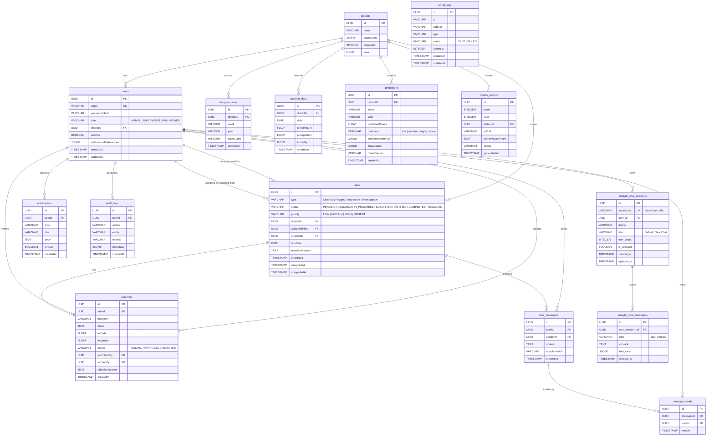

# EpiLink — Database Diagram 

## Entity Summary

| Entity | Description | Key Relations |
|---|---|---|
| `districts` | Sri Lanka district boundaries and metadata | Parent of cases, weather, predictions, tasks, reports |
| `users` | System users with roles and district assignments | Belongs to district; creates/assigned tasks; owns chat sessions |
| `dengue_cases` | Weekly case counts per district | Belongs to district |
| `weather_data` | Weather observations (temp, precipitation, humidity) | Belongs to district |
| `predictions` | ML ensemble predictions with 80% CI, risk level, SHAP values | Belongs to district |
| `tasks` | Cleanup/fogging/inspection/investigation assignments | Belongs to district; links creator and assigned PHI |
| `evidence` | Geo-tagged photos and notes from field visits | Belongs to task; links submitter and verifier |
| `task_messages` | Task-scoped real-time chat between PHI and supervisor | Belongs to task; linked to sender |
| `message_reads` | Per-user read receipts for unread badge counts | Junction: message × user |
| `notifications` | In-app alerts and system notifications | Belongs to user |
| `email_logs` | Sent/failed email audit records for retry and reporting | Standalone audit |
| `audit_logs` | User activity tracking (action, entity, metadata) | Belongs to user |
| `weekly_reports` | Generated PDF reports with AI narrative summaries | Belongs to district |
| `analytic_chat_sessions` | AI chat session index — title, district, Redis key, archive flag | Belongs to user |
| `analytic_chat_messages` | Full message log with tool call traces (Postgres fallback) | Belongs to session |
